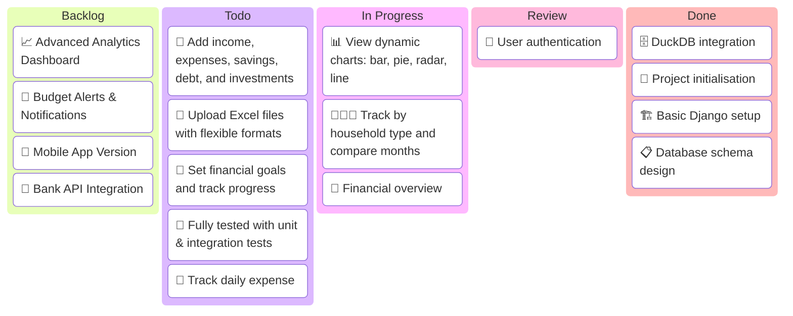

<h1 align="center"> Financial tracker web application </h1>
<p align="center"></p>

<h3 align="center">by (Lydia)Chia Zen Orchard⚡

## Project Background Information
A Django-based web application that helps users **track daily income and expenses**, set and monitor **financial goals**, and visualise their **spending trends** using dynamic charts. Ideal for individuals or families who want to take control of their personal finances.


## Objectives
1. Provide a visual overview of a user’s financial situation.
2. Help users track income and expenses over time.
3. Visualise budget vs actual expenses, savings, and investment patterns over time.
4. Support household types (single, couple, family).
5. Enable Excel uploads for batch tracking.
6. Assist users with financial goals.

<hr>

## 📁 Features


<hr>

## Tech stacks

| Category         | Tools / Libraries                    |
|------------------|--------------------------------------|
| Backend        | Python, Django                       |
| Data Handling  | Pandas, NumPy                        |
| Visualization  | Plotly, Matplotlib                   |
| Database       | DuckDB (Local), PostgreSQL (Prod)    |
| Frontend       | HTML, CSS, Django Templates          |
| Auth           | Django Built-in Authentication       |
| Deployment     | Local + CLI Workflow                 |
| Testing        | Pytest, Django Test Framework        |
| Version Control| Git & GitHub                      |

<hr>
## 📁 Directory

```bash
finance-app/
├── core/                  # Django app logic
|   ├── db/                # DuckDB table (schema, data, script)
|   ├── frontend_templates/# HTML ,CSS templates
│   ├── models.py          # Database models
│   ├── views/             # Split views (charts, auth, dashboard, upload)
│   ├── services/          # DuckDB query logic
│   ├── charts/            # Plotly chart rendering
│   ├── apps.py            
│   ├── urls.py            # Local URL patterns for this app
│   ├── models.py          # Define database tables here
│   ├── forms.py           # Django forms
│   └── tests/             # Unit tests & integration tests
├── db/                    # DuckDB file
├── config/                # Django settings
├── manage.py              # Runserver
├── .env                   # Store Environment variables 
├── gitignore              # Define environment variables excluded from Git
└── README.md              # This file
